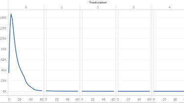
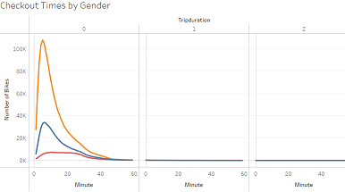
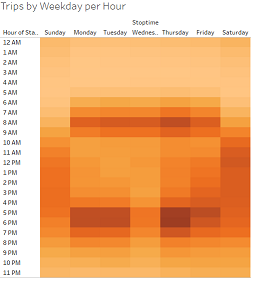
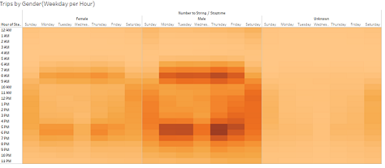
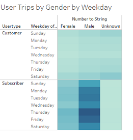
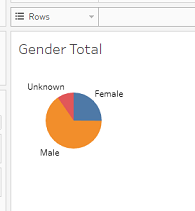
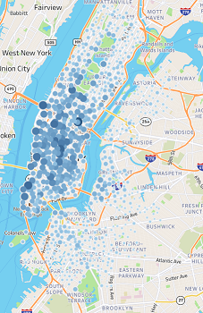
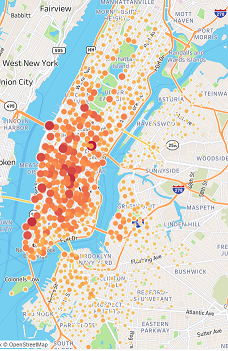

# bikesharing
Final story Link : [link to dashboard](https://public.tableau.com/app/profile/derek.lescarbeau/viz/Tableau_Challenge_16420418850980/Story1?publish=yes)

Overview of Analysis:

In this module, we analyzed citibike data from August of 2019 to see if a similar bikesharing program can be used in a different city. We created a number of graphs and visualizations to explain how the bikesharing worked in New York City, what demographics were utilizing the bikesharing program, and what time and what day the bikes were being utilized. The following images and captions will help explain the findings. 

Analysis:

Checkout times for users:

In this visualization we compared the number of users with and their checkout times. Looking at the data, we see that a majority of the bikes are checked out for no longer than 45 mins. The count for the number of trips dips below 10,000 checkouts for the month starting at the 38 min mark. Once we hit the 45 min mark, we see the amount of user count drop to below 4,000. After the 1 hr mark, we see the number of trips dip down below 1000. The conclusion that I draw from this is that people in the city are mostly using the bike for transportation from one location in the city to another to simply get around faster. There are far less bike checkouts being used to simply leisure activities.

Checkout times by gender:

When looking at this graph we were able to breakdown the checkout times by gender. When looking at this graph we can see the majority of the trips for males greatly exceed the number of trips taking by females. At the peak for the men, the count of checkouts is 108,000 at 5 min mark. The peak for women is at the 6 min mark with a total number just over 34,000. This makes sense because over half the data that is collected is from male users. 

Trips by weekday per hour:

For the month of august we broke down the trips to see the most popular start times by weekday. As shown in the heatmap, we can see the most popular or the most start times occurred after 6pm on Thursdays. The second most popular start time in our data was 5pm on Thursdays with 1,000 less trips than the 6pm start time. 

Trips by Gender( Weekday per hour):

This is the same heatmap that we created for trips by weekday per hour but with an extra filter. We broke down the trips by weekday per hour and separated it by gender. As seen in the heatmaps, we can see that most of the trips recorded in the citibike data csv were by males. A good indication of this is the shading. We can see that the popular day and time(Thursday 5pm and 6pm) is shaded the darkest for the male users. Even though we separated the heatmaps by gender, the popular times and day doesn’t change.  Thursday at 5pm and 6pm for the month of august is still the darker parts of the heatmap for both the males and the females. 

User Trips by gender by weekday:

This heatmap directly relates to the past two heatmaps but with a different filter. As we saw in the past two heatmaps, we saw that Thursday was the more popular day for bike trips. This heatmap builds off of the last one where the users are filtered into two types. The heatmap is filtered by customer and subscriber as well as gender. As we can see from this heatmap we see that the most popular day is Thursday. Demographic that is using the bikes the most are male in the subscriber user type. The count for this category exceeds 250,000. If we were to look at the customer user category, we see that the most popular day in this dataset is Saturday with around 40,000 users in the customer category. When we break down the heat map into the two types of users, we can see the most popular day for subscribers is Thursday and the most popular day for customers is Saturday. 

Module graphs:
For my module graphs I chose to include the gender count pie chart, the starting locations and the stop locations. 
Gender pie chart:

The gender pie chart was used because it is important to show how the data will be viewed in context when the gender counts are shown. Its important to show the data and have the gender counts in mind to help further explain the data. As we went through the challenge we broke down every graph by gender anyways, but it was important to show the count of the genders against one another. 

Top start and stop locations:
Start locations: Stop Locations:
For my other maps or graphs I used from the module, I used the start and stop latitude and longitudes map. Instead of keeping the original light map that we used in the module, I changed the map to the streets map. I wanted to see where the actual locations in the citibike kiosks where in relation to important landmarks or mass transit stations. I wanted to see if the top locations where around landmarks where tourists would go to visit, parks people would go or if the people would use the bikes to transport themselves to mass transit locations. I wanted to get a sense if people would use the bikes as a mode of transportation in their daily commute to work. 
As soon as I am able to see the on the street level of the map, I see that 3 of the most popular start locations is in fact located near areas of mass transit. One location is grand central station, another NY Penn station and another is located near the ferry location. 
The most popular ending locations include those three areas with mass transit along with areas around parks, the world trade center, and different subway stations. So we can figure that users do indeed use the bikes to and from mass transit areas, visiting popular landmarks in the city and using the bikes to transport themselves to and from work. 

Summary:
After doing this analysis, I believe that the citibike bikesharing program would be successful in another city. Users could use the bikes for commuting to work, other locations of mass transit and landmarks in the city. 
Other visulizations that would be useful in this analysis would be route data to track the milage of the bikes being used to get a more advanced analysis on how the bikes are being used. Being able to track the milage would also help bike maintenance. If we were able to track the mileage we could maintain the bikes more efficiently and not by the number of checkouts. Another visualization that we should use would be the number of times a certain user uses a bike and for how long. This would further our understanding on what exactly the demographic is that uses the bike more often. Right now, our graphics that take into account the demographic is not as specific as it could be. If we were able to keep track of the user id and somehow get that user id’s demographic profile into a visualization, that would help make our visualizations more specific. 

